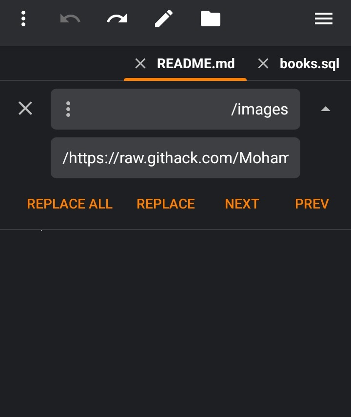

 

Installation and Image Configuration

When downloading the books/ folder, follow one of the methods below to ensure that image paths work correctly.

Method 1 — Use Local Images

Upload the images/ folder to your own website or server. Make sure the image paths referenced in your SQL data point to the correct location.

Method 2 — Use GitHub Images as a CDN

You can use the images hosted in this repository without uploading them to your own server.

Open your SQL file in any code editor that supports Replace All.

Search for the following path:

images/

Replace it with the following URL:

https://raw.githack.com/Mohamed45413/SQL/main/books/images/

Apply the replacement to all matching paths and save the SQL file.

For example, a local image path:

images/authors/Chinua_Achebe.jpeg 

Becomes:

https://raw.githack.com/Mohamed45413/SQL/main/books/images/authors/Chinua_Achebe.jpeg 

This allows your database records to reference images hosted in this GitHub repository instead of requiring you to host the files yourself.